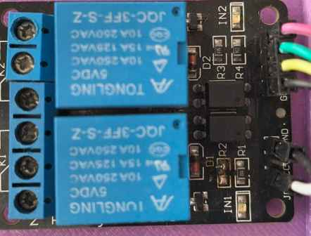
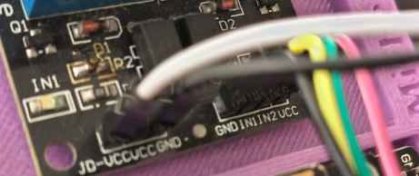

# Manual de Conexões: Módulo Relé de 2 Canais

Este documento explica o funcionamento e o mapeamento de pinos de um **módulo relé de 2 canais com isolamento por optoacoplador** (modelo Tongling JQC-3FF-S-Z de 5VDC).

---

## 1. Pinos de Controle (Barra de 4 Pinos)

Estes pinos são conectados diretamente ao seu microcontrolador (Arduino, ESP32, Raspberry Pi, etc.) para enviar os comandos de ativação.

*   **VCC**: Entrada de alimentação positiva de 5V (referência lógica).
*   **IN1**: Pino de sinal digital para controlar o **Relé 1** (Geralmente ativa em nível lógico baixo / *Low*).
*   **IN2**: Pino de sinal digital para controlar o **Relé 2** (Geralmente ativa em nível lógico baixo / *Low*).
*   **GND**: Pino de aterramento (negativo) comum do circuito de sinal.

---

## 2. Jumper de Isolamento e Alimentação Externa (Barra JD-VCC / VCC / GND)

Esta seção de 3 pinos permite escolher como as bobinas internas dos relés serão alimentadas. Configurar isso corretamente protege seu microcontrolador contra ruídos e picos de energia.

*   **JD-VCC**: Pino que alimenta diretamente as bobinas dos relés.
*   **VCC (Pino Central)**: Interligado diretamente ao pino VCC da barra de controle anterior.
*   **GND**: Pino de aterramento extra.

### Modos de Configuração

### Modo 1: Alimentação Compartilhada (Sem Isolamento Total)
*   **Como fazer:** Conecte um jumper plástico unindo os pinos **JD-VCC** e **VCC**.
*   **Funcionamento:** A energia de 5V que alimenta o microcontrolador também alimentará os relés. 
*   **Uso:** Recomendado para testes rápidos ou cargas de baixa potência.
> ✨ **Nota sobre ligação:** use a ligação dos jumpers JD-VCC e VCC, apenas para fins de teste rápido, nunca para uso em produção.

### Modo 2: Alimentação Separada (Isolamento Optoacoplado Total)
*   **Como fazer:** Remova o jumper plástico entre JD-VCC e VCC. Conecte uma fonte de 5V externa exclusiva nos pinos **JD-VCC (+)** e **GND (-)** desta barra.
*   **Funcionamento:** O microcontrolador alimenta apenas os LEDs dos optoacopladores, enquanto a fonte externa aciona as bobinas magnéticas.
*   **Uso:** Recomendado para projetos finais ou ao acionar cargas pesadas (como motores ou lâmpadas fluorescentes), pois evita reinicializações indesejadas no microcontrolador.

> ⚠️ **Atenção:** Sempre verifique a corrente máxima suportada pelo relé e pela fonte externa. Evite sobrecarga.

## imagem ilustrativa do módulo relé de 2 canais com isolamento por optoacoplador:

